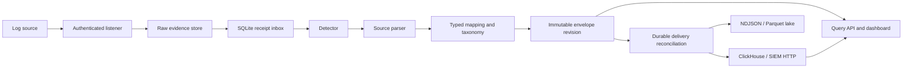

# Universal Log Processing Framework handbook

## What the project does

ULPF accepts security and operational events from different sources, preserves
the exact accepted bytes, extracts source fields, maps them into a common OCSF
based event shape, records field lineage, and exports immutable revisions to
SIEM and data-lake destinations. The embedded dashboard shows the live path
from receipt through interpretation and delivery.

The repository is a deployable single-node reference implementation and a set
of reusable bounded components. Multiple nodes can be shown in one dashboard
through configured federation. ClickHouse provides a shared indexed event
backend. Clustered high availability, organization-specific disaster recovery,
and native-platform release qualification remain deployment responsibilities.

## Data flow



Admission commits raw bytes before it creates an `ACCEPTED` receipt. A worker
leases the receipt, verifies the retained evidence, detects a parser, parses and
maps it, then commits an immutable revision and complete envelope. Delivery
reconciliation repeatedly discovers every committed envelope and idempotently
creates connector work, so a process failure between revision commit and export
cannot permanently lose a revision.

## Core records

- A **receipt** is the immutable acquisition record: tenant, environment,
  instance, listener, peer, transport, source profile, framing, raw reference,
  byte length, and SHA-256.
- A **revision** identifies one interpretation of a receipt. Reprocessing adds a
  revision and never overwrites retained bytes or earlier interpretations.
- An **envelope** combines the receipt, processing identity, canonical event,
  parsed and unmapped fields, issues, quality, and per-leaf provenance.
- An **export record** is the connector projection. It contains the complete
  canonical envelope and indexed scalar fields, but never raw payload bytes.

The normative envelope schema is
[`schemas/ulpf-envelope-1.0.0.json`](../schemas/ulpf-envelope-1.0.0.json).
Canonical values without provenance are rejected. Every accepted occurrence
gets its own receipt even when the payload hash matches another event.

## Runtime configuration

`ulpf serve --config PATH` consumes the same strict configuration contract that
`ulpf validate-config` validates. Unknown fields, unsafe paths, invalid IDs,
wrong connector fields, and contradictory settings fail before the listener
starts. Secrets are referenced as `env:NAME` or absolute `file:/path`; secret
values are not accepted inline and are not included in errors.

The example is [`configs/runtime.example.yaml`](../configs/runtime.example.yaml).
It defines:

- deployment environment, instance, tenant, and API token reference;
- listeners and trusted source-profile selection by longest CIDR match;
- worker limits and processing timeout;
- SQLite, raw evidence, and immutable bundle paths;
- retention intent;
- ClickHouse, HTTP, NDJSON, or Parquet connectors;
- optional federation peers whose tokens remain server-side.

The legacy flags remain useful for a minimal local process. Production and
container deployments should use the configuration file.

## Authentication and tenant boundaries

HTTP APIs require bearer tokens with explicit scopes and tenant grants. Ingest,
event metadata, raw evidence, configuration, and replay permissions are
separate scopes in the authorization package. The embedded runtime currently
creates one deployment token for its configured tenant. Federation uses a
different configured token for every peer and proxies trace reads locally, so
peer credentials never enter browser storage.

The dashboard stores the operator-entered local bearer token in session storage
only. Raw event bytes are never fetched or displayed by the dashboard.

## Ingestion and evidence preservation

The local service exposes:

```text
POST /api/v1/ingest
Content-Type: application/octet-stream
Authorization: Bearer <token>
```

Request size is bounded before and during streaming. The filesystem evidence
store writes durably, records SHA-256 and byte count, and rejects path escape and
corruption. SQLite tracks receipt leases and recovers expired work after a
restart. Syslog TCP/UDP framing components are available as bounded library
listeners; the single-process `serve` command currently exposes one HTTP
listener.

## Parsing, normalization, and source bundles

Built-in syntax parsers cover JSON, Syslog, CEF, LEEF, XML, CSV, and key-value
events. Declarative RE2 parsers support source formats without loading native or
executable plugins. Failed or ambiguous detection produces an explicit
`UNPARSED`, `PARTIALLY_PARSED`, or error revision; it never fabricates canonical
values.

A bundle contains a manifest, parser configuration, fingerprints, mappings,
taxonomies, positive and negative fixtures, and expected canonical output.
Installation checks paths, executable bits, size limits, declared SHA-256
values, runtime compatibility, fixture behavior, deterministic output, mapping
coverage, and complete provenance.

Two examples are included:

- [`bundles/reference/json-firewall`](../bundles/reference/json-firewall)
- [`bundles/reference/kv-firewall`](../bundles/reference/kv-firewall)

They normalize different source syntaxes into the same canonical event while
retaining source-only fields as unmapped data.

Useful commands:

```bash
ulpf bundle validate --json ./bundles/reference/json-firewall
ulpf bundle scaffold --id my-firewall --format json ./my-firewall
ulpf bundle test --json ./my-firewall
ulpf bundle install --sqlite /var/lib/ulpf/state/ulpf.sqlite \
  --catalog /var/lib/ulpf/bundles ./my-bundle
ulpf bundle list --sqlite /var/lib/ulpf/state/ulpf.sqlite \
  --catalog /var/lib/ulpf/bundles
ulpf bundle activate --sqlite /var/lib/ulpf/state/ulpf.sqlite \
  --catalog /var/lib/ulpf/bundles --source-profile firewall-a \
  --sha256 DIGEST --expected-revision 0 --actor operator@example
ulpf bundle rollback --sqlite /var/lib/ulpf/state/ulpf.sqlite \
  --catalog /var/lib/ulpf/bundles --source-profile firewall-a \
  --sha256 PRIOR_DIGEST --expected-revision 1 --actor operator@example
```

Configured bundle directories are installed, semantically compiled, activated,
and reconstructed at startup. Authenticated control endpoints list bundles and
activations, perform compile-before-CAS live activation or rollback, and
schedule/status durable reprocessing. The executor reloads the exact installed
digest, verifies retained evidence, and atomically stores a complete new
immutable envelope; retries survive restart. The runtime router selects its
atomic compiled snapshot by trusted receipt source profile while unconfigured
profiles use the built-in syntax fallback.

## APIs and traceability

The tenant-scoped API provides bounded event listing, event detail, receipt and
revision history, and separately authorized raw evidence retrieval. Cursor
ordering is stable. A trace can follow:

```text
receipt ID → revision ID → parser/mapping/bundle versions
           → canonical field provenance → raw reference/SHA-256/size
```

See [`docs/API.md`](API.md) for request and response details.

## Delivery and integrations

The running service constructs connectors from the runtime configuration. A
reconciler projects all committed envelopes and idempotently admits each
revision to every connector. Connector workers use bounded batches, leases,
retry with backoff, circuit cooldown, permanent-failure dead letters, and
graceful cancellation.

Tenant-scoped authenticated operations endpoints expose connector status,
dead-letter metadata, and replay. Required connectors gate receipt delivery
state; optional failures remain visible and replayable without blocking the
receipt.

Supported destinations are:

| Connector | Purpose | Behavior |
|---|---|---|
| ClickHouse | searchable SIEM/index backend | authenticated JSONEachRow inserts and revision deduplication |
| HTTP | generic SIEM/webhook | HTTPS by default, bearer token reference, bounded responses |
| NDJSON | portable local export | append, sync, restrictive file permissions |
| Parquet | local/air-gapped data lake | immutable tenant/date partitions, atomic rename, hash manifest |

ClickHouse can also serve the event query API when `query_backend: true`.
[`migrations/clickhouse/001_events.sql`](../migrations/clickhouse/001_events.sql)
creates the indexed table and includes environment/instance identity.

## Analytics and ML readiness

Parquet rows carry revision and raw-hash lineage, processing identities, quality,
issue codes, indexed canonical values, and the complete normalized envelope.
Raw payload bytes are excluded. Batch manifests bind the revision set to the
Parquet file hash.

The versioned contracts are:

- [`schemas/ulpf-feature-set-1.0.0.json`](../schemas/ulpf-feature-set-1.0.0.json)
- [`schemas/ulpf-dataset-manifest-1.0.0.json`](../schemas/ulpf-dataset-manifest-1.0.0.json)

Go validation rejects raw-data feature paths, duplicate or unordered features,
unsafe artifact paths, invalid splits, missing lineage, and mismatched dataset
identity. `ulpf dataset export` reads one tenant, applies an explicit
include/exclude/reject policy for partial events, orders revisions stably,
derives SHA-256 train/validation/test splits, extracts typed features, and
publishes immutable Parquet plus its manifest idempotently. The project produces
governed analytics artifacts; model training, model quality claims, embeddings,
inference, and a model registry are outside the runtime.

## Dashboard and federation

`/dashboard/` is embedded into the binary. It refreshes tenant-scoped totals,
pipeline stages, activity, interpretation status, recent events, delivery
counts, and trace metadata. It displays event environment and instance origin.

Configured federation peers are queried concurrently with individual timeouts.
Totals and activity are aggregated, recent events retain their origin, and
unavailable or stale nodes remain visible instead of appearing as zero
activity. A bounded tenant-specific last-known cache retains the previous peer
summary during outage. Operators can filter and recompute the dashboard by
environment and instance. Cross-node receipt and event traces pass through an
authenticated local proxy.

This is bounded application-level federation. Large deployments should use a
shared ClickHouse cluster and qualify its replication, availability, and data
retention for their environment.

## Containers and Compose

The Docker image is a static non-root binary on a distroless base. The runtime
filesystem is read-only except for declared state, raw evidence, bundle, and
temporary paths. Linux capabilities are dropped and no-new-privileges is set.

[`compose.yaml`](../compose.yaml) starts ULPF and ClickHouse, mounts the
authoritative runtime configuration, applies the ClickHouse migration, uses
persistent volumes, and waits on health checks.

```bash
export ULPF_API_TOKEN='replace-with-a-long-random-token'
export CLICKHOUSE_PASSWORD='replace-with-a-long-random-password'
docker compose up --build
```

Open `http://localhost:8080/dashboard/` and enter tenant `demo` plus the ULPF
token.

Run `./scripts/seed-dashboard-demo.py` with the same token in
`ULPF_API_TOKEN` to admit the synthetic multi-source demonstration. It covers
14 source shapes and JSON, CEF, LEEF, key-value, Syslog, XML, and CSV parsing;
the dashboard can filter the resulting event window by source family, format,
status, or text.

## Air-gapped installation

The offline builder emits architecture-specific image archives, image-only
Compose with `pull_policy: never` and a non-masqueraded Docker bridge,
migrations, schemas, documentation, required
SBOM/vulnerability/license inventories, and checksums. It signs an expiring
statement that binds the outer archive digest to a publisher key. Verification
uses a separately provisioned public key and revocation list, then validates
image tag, Linux OS, architecture, config digest, layers, Compose references,
and all checksum layers. Test mode is explicit and cannot approve a release.
The current public verification key is versioned at
[`release/trust/offline-signing-public.pem`](../release/trust/offline-signing-public.pem);
the matching private key exists only as a GitHub Actions secret.

See [`docs/OFFLINE_INSTALL.md`](OFFLINE_INSTALL.md). Native amd64 and arm64
engines in [release run 36581794182](https://github.com/sidd20228/universal_log_framework/actions/runs/36581794182)
removed the release tags, loaded only the signed archives, verified Docker's
egress control and a rejected external probe, and passed start, authenticated
ingest/query/dashboard, and restart persistence with pulls disabled. The
machine-readable proofs are in `output/evaluation/`.

## Operations

Persistent state consists of the SQLite database, raw evidence root, immutable
bundle catalog, connector outputs, and ClickHouse data. Back up SQLite and the
matching raw tree from a consistent snapshot. A restore is valid only after
receipt IDs, raw hashes, and envelope hashes are checked together.

Readiness reports when the HTTP service is accepting work. Connector delivery
continues independently when another connector is unavailable. Monitor receipt
queue age, dead letters, connector retries, raw disk capacity, SQLite WAL size,
ClickHouse health, and federation staleness. Keep enough free disk for raw data,
ClickHouse merges, Parquet batches, container images, and offline archives.

For this repository's current development machine, the host has 10 CPU cores
and 16 GiB RAM; Docker has 10 CPUs and about 9.7 GiB RAM. That allocation passed
the complete unit, race, schema, security, offline-package, and arm64 Compose
admission-to-ClickHouse-query verification on 2026-09-29. CPU and memory are not
blocking local development. Free disk is the present constraint: about 32 GiB
remains on a 460 GiB volume, which leaves little room for sustained raw evidence,
ClickHouse merges, image archives, and Parquet output.

Use an Ubuntu VM for repeatable release and load qualification. A practical
minimum is 4 vCPU, 16 GiB RAM, and 100 GiB free SSD; use 8 vCPU, 32 GiB RAM, and
250 GiB or more for sustained ingestion and retention tests. Keep native amd64
and arm64 runners so every release continues to prove both packaged architectures.

## Development and verification

```bash
go test ./...
go test -race ./...
go vet ./...
./scripts/validate-schemas.sh
./tests/offline/test-offline-bundle.sh
./scripts/verify-evaluation.sh
```

Tests cover admission durability, duplicate occurrences, corruption, leases,
detectors and parsers, mapping provenance, compiled bundle fixtures, live HTTP
normalization, authorization, query isolation, connector retry/idempotency,
Parquet readback, analytics contracts, federation partial failure, offline
archive attacks, and end-to-end fault injection.

## Outcome coverage and honest boundaries

The detailed a–k assessment is in
[`docs/EXPECTED_OUTCOMES.md`](EXPECTED_OUTCOMES.md). Local code now implements
raw preservation, supported parsing, configured taxonomy mapping and lineage,
signed declarative onboarding, bounded federation,
SIEM/ClickHouse/NDJSON/Parquet delivery, analytics contracts, disk-aware
admission, retention with holds, verified local backup/restore, and signed
container/offline packaging, including native Linux amd64/arm64 clean installs.
Enterprise HA and offsite disaster recovery and organization-specific capacity
qualification require target infrastructure and must not be inferred from
single-node tests.
